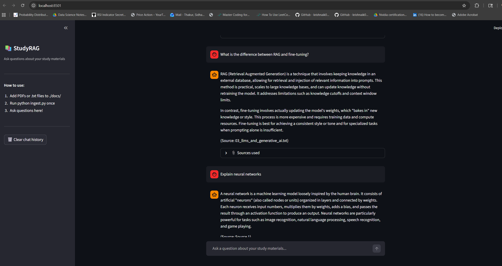
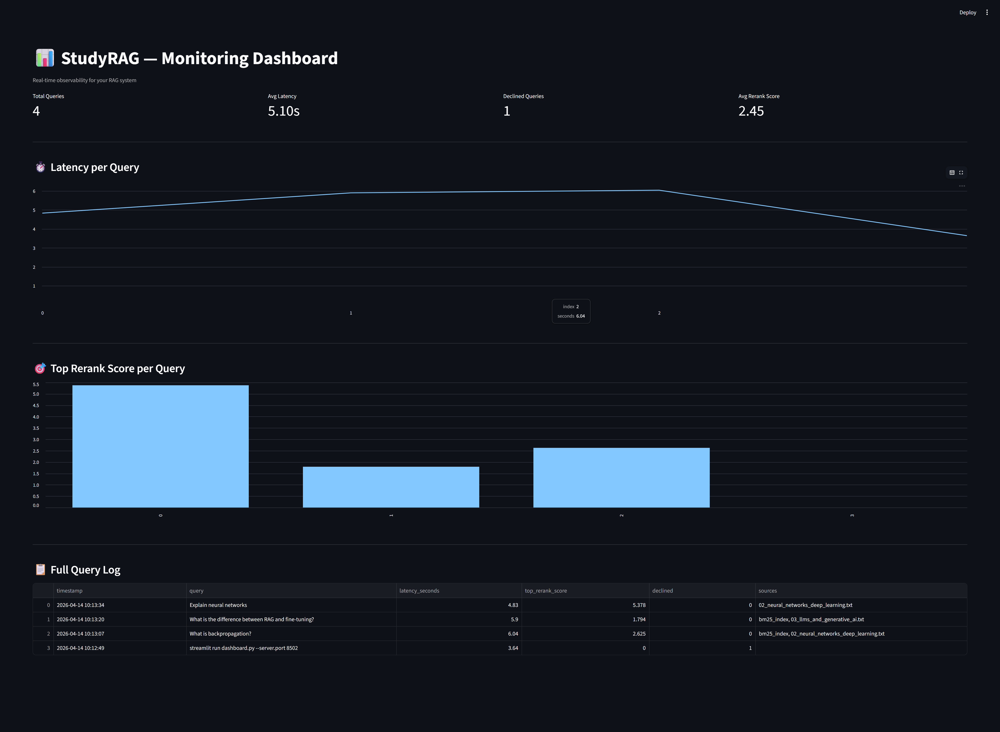

# 📚 Production RAG System

Ask questions over your own documents using hybrid AI search.

---

## 📸 Screenshots

**RAG Chat Interface**

**Monitoring Dashboard**

---

## ✨ Features

- Hybrid retrieval — BM25 keyword search + vector semantic search
- Cross-encoder reranking for higher precision
- Citation enforcement — declines if context doesn't support the answer
- LangSmith tracing — every query tracked end-to-end
- Monitoring dashboard — latency, quality scores, declined queries
- Chat UI built with Streamlit

---

## 🛠️ Tech Stack

- **LLM:** OpenAI GPT-4o-mini
- **Embeddings:** text-embedding-3-small
- **Vector DB:** ChromaDB
- **Keyword Search:** BM25
- **Reranker:** ms-marco-MiniLM-L-6-v2
- **Tracing:** LangSmith
- **UI:** Streamlit

---

## 🚀 How to Run

1. Add your documents to `./docs/`
2. Create `.env` file with your API keys
3. Run `python ingest.py`
4. Run `streamlit run app.py`
5. Run `streamlit run dashboard.py --server.port 8502` for monitoring

---

